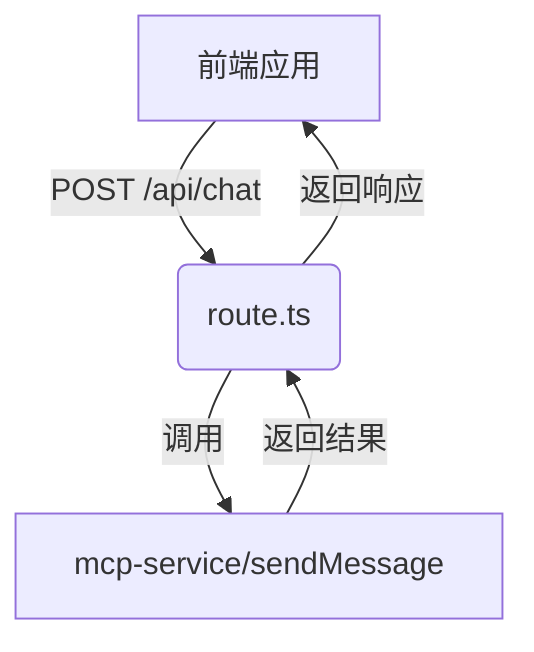

# packages/mcp-client/app/api/chat/route.ts
```markdown
# 代码分析报告

## 文件信息
- **路径**: `packages/mcp-client/app/api/chat/route.ts`
- **类型**: Next.js API 路由处理器

## 功能概述
该文件实现了一个聊天消息处理的API端点，主要功能是：
1. 接收用户聊天消息和历史记录
2. 验证输入数据
3. 将消息转发给MCP服务处理
4. 返回处理结果或错误信息

## 模块职责
### 主要职责
- 提供`POST`方法API端点
- 处理HTTP请求和响应
- 输入验证和错误处理
- 作为前端与MCP服务之间的桥梁

### 详细职责分解
1. **请求处理**:
   - 接收`NextRequest`对象
   - 解析JSON请求体
   - 验证必填字段(message)

2. **业务逻辑**:
   - 记录调试信息(控制台输出)
   - 调用`sendMessage`服务

3. **响应处理**:
   - 返回JSON格式响应
   - 处理成功和错误场景

## 依赖关系
### 内部依赖
- `next/server`: 使用`NextRequest`和`NextResponse`类型和工具
- `@/lib/mcp-service`: 依赖`sendMessage`服务函数

### 外部接口
- **输入**: 接收POST请求，预期JSON格式:
  ```typescript
  {
    message: string;    // 必需，用户消息内容
    history?: any[];    // 可选，历史消息数组
  }
  ```
- **输出**: 返回JSON响应:
  - 成功: `sendMessage`返回的结果
  - 错误: 包含错误信息的对象

## 错误处理
- **400 Bad Request**: 当`message`字段为空时返回
- **500 Internal Server Error**: 处理过程中发生未捕获异常时返回
- 所有错误都会在服务器控制台记录

## 日志记录
- 记录接收到的用户消息
- 记录历史消息数量
- 记录处理过程中的错误

## 与其他模块的关系


## 改进建议
1. 考虑添加更详细的输入验证
2. 可以添加请求频率限制
3. 考虑使用结构化日志系统替代console.log
4. 可以添加TypeScript接口明确定义请求/响应格式
```

# packages/mcp-client/app/api/tools/route.ts
```markdown
# 代码分析：`packages/mcp-client/app/api/tools/route.ts`

## 文件作用
这是一个Next.js API路由文件，主要负责处理对`/api/tools`路径的GET请求，返回可用的工具列表。

## 模块职责
1. **路由处理**：
   - 定义并导出一个异步GET请求处理函数
   - 处理成功和错误的响应场景

2. **数据获取**：
   - 通过调用`getTools()`方法从MCP服务获取工具数据
   - 将获取的数据封装成JSON响应

3. **错误处理**：
   - 捕获并记录数据获取过程中的错误
   - 返回带有错误信息的500状态响应

## 依赖关系
- **内部依赖**：
  - `next/server`：使用Next.js的`NextResponse`处理HTTP响应
  - `@/lib/mcp-service`：导入`getTools`方法获取工具数据

- **被依赖关系**：
  - 作为API端点被前端组件调用(通常通过fetch或axios)

## 接口规范
- **成功响应**：
  ```json
  {
    "tools": [...] // 工具列表数组
  }
  ```

- **错误响应**：
  ```json
  {
    "error": "错误消息内容"
  }
  ```
  状态码：500

## 扩展性考虑
1. 未来可以添加其他HTTP方法(POST/PUT等)来实现工具管理功能
2. 可以增加请求参数处理来支持分页/过滤等功能
3. 错误处理可以进一步细化不同的错误类型和状态码

## 潜在改进
1. 添加请求参数验证
2. 实现更详细的错误日志记录
3. 考虑添加缓存机制减少对mcp-service的频繁调用
```

# packages/mcp-client/lib/config.ts
```markdown
# 配置文件分析 (`packages/mcp-client/lib/config.ts`)

## 文件作用
- 负责管理应用程序的配置信息
- 从环境变量(`.env`)加载配置并提供类型安全的访问接口
- 为MCP客户端和AI服务提供默认配置值

## 模块职责
1. **环境变量加载**
   - 使用`dotenv`库加载`.env`文件中的环境变量
   - 通过`dotenv.config()`初始化环境变量

2. **配置类型定义**
   - 定义`Config`接口描述配置结构
   - 包含两个主要配置部分:
     - `mcp`: MCP服务器相关配置
     - `ai`: AI服务相关配置

3. **默认配置提供**
   - 提供默认配置对象`config`
   - 从环境变量读取值，提供合理的默认值

## 配置项详情
### MCP配置
| 配置项 | 环境变量 | 默认值 | 描述 |
|--------|----------|--------|------|
| serverUrl | MCP_SERVER_URL | `http://localhost:8083/sse` | MCP服务器地址 |

### AI配置
| 配置项 | 环境变量 | 默认值 | 描述 |
|--------|----------|--------|------|
| deepseekApiKey | DEEPSEEK_API_KEY | `""` | DeepSeek API密钥 |
| deepseekApiUrl | DEEPSEEK_API_URL | `https://api.deepseek.com/v1/chat/completions` | DeepSeek API地址 |
| defaultModel | DEFAULT_MODEL | `"deepseek-chat"` | 默认AI模型 |

## 与其他模块的关系
1. **依赖关系**
   - 依赖`dotenv`包处理环境变量
   - 依赖Node.js环境变量(process.env)

2. **被依赖关系**
   - 可能被MCP客户端模块导入以获取服务器配置
   - 可能被AI服务模块导入以获取API配置
   - 作为应用程序的基础配置模块被多个功能模块使用

3. **扩展性**
   - 通过`Config`接口可以方便地添加新的配置项
   - 类型系统确保配置访问的安全性

## 使用建议
1. 在生产环境中应通过环境变量覆盖默认值
2. 敏感信息(如API密钥)不应硬编码在配置文件中
3. 可通过扩展`Config`接口来添加新的配置区域
```

# packages/mcp-client/lib/mcp-service.ts
```markdown
# MCP 客户端服务模块分析

## 文件信息
- **路径**: `packages/mcp-client/lib/mcp-service.ts`
- **类型**: 核心服务模块

## 模块职责
该模块主要负责与 Model Context Protocol (MCP) 服务器建立连接、管理工具调用和 AI 交互，提供以下核心功能：

1. **MCP 客户端连接管理**
   - 初始化 MCP 客户端连接
   - 处理连接重试和错误恢复
   - 管理连接状态

2. **工具调用服务**
   - 提供工具列表获取功能
   - 执行远程工具调用
   - 管理工具调用缓存

3. **AI 交互服务**
   - 处理 AI 消息发送
   - 格式化 AI 响应
   - 管理 AI 客户端

4. **缓存管理**
   - 实现带过期时间的缓存机制
   - 优化重复请求性能

## 主要接口与功能

### 1. 初始化功能
```typescript
export async function initMcpClient()
```
- 职责: 初始化 MCP 客户端连接
- 特点:
  - 实现单例模式
  - 包含连接重试逻辑
  - 并发控制机制

### 2. 工具调用
```typescript
export async function callTool(name: string, args: any)
```
- 职责: 调用远程工具
- 特点:
  - 自动缓存结果
  - 内置重试机制
  - 参数校验

### 3. 工具管理
```typescript
export async function getTools()
```
- 职责: 获取可用工具列表
- 特点:
  - 缓存优化
  - 自动初始化检查

### 4. AI 交互
```typescript
export async function sendMessage(message: string, history: any[] = [])
```
- 职责: 与 AI 服务交互
- 特点:
  - 消息格式化
  - 历史记录管理
  - 错误处理

## 模块关系

### 依赖模块
1. **@modelcontextprotocol/sdk**
   - 提供 MCP 客户端基础功能
   - 包含 SSE 传输协议实现

2. **本地配置模块**
   - `./config`: 提供服务器配置

3. **工具辅助模块**
   - `./utils`: 提供 DeepSeek 客户端创建功能

### 被依赖关系
该模块可能被以下类型模块调用:
1. **API 路由层**
   - 提供 HTTP 接口
   - 转换外部请求格式

2. **业务逻辑层**
   - 组合多个工具调用
   - 实现复杂业务流程

3. **其他服务模块**
   - 需要 AI 功能的模块
   - 需要工具调用的模块

## 关键设计特点

1. **健壮性设计**
   - 连接重试机制
   - 错误处理完善
   - 并发控制

2. **性能优化**
   - 结果缓存
   - 避免重复初始化
   - 缓存过期机制

3. **可扩展性**
   - 工具动态加载
   - 响应格式化可配置

4. **可维护性**
   - 清晰的接口定义
   - 完善的日志记录
   - 类型安全

## 改进建议

1. **配置可扩展性**
   - 缓存时间可配置化
   - 重试策略可调整

2. **监控增强**
   - 添加性能指标
   - 连接状态事件

3. **测试覆盖**
   - 增加边界条件测试
   - 模拟网络故障场景
```

# packages/mcp-client/lib/storage.ts
```markdown
# 代码分析：packages/mcp-client/lib/storage.ts

## 文件作用
该文件是一个本地存储工具模块，专门用于处理聊天消息(MCP Chat Messages)在浏览器本地存储(localStorage)中的持久化操作。

## 模块职责
1. 提供对聊天消息的CRUD操作：
   - 保存消息到本地存储
   - 从本地存储加载消息
   - 清除本地存储中的消息
2. 错误处理：所有操作都包含try-catch块来捕获可能的异常
3. 环境检查：确保在浏览器环境下运行(检查window对象是否存在)

## 核心功能

### 1. 保存消息
```typescript
export function saveMessages(messages: Message[]): void
```
- 将消息数组序列化为JSON字符串
- 使用localStorage存储，键为`mcp_chat_messages`
- 静默处理错误(仅打印到控制台)

### 2. 加载消息
```typescript
export function loadMessages(): Message[]
```
- 从localStorage读取存储的消息
- 如果不存在或解析失败则返回空数组
- 同样包含错误处理

### 3. 清除消息
```typescript
export function clearMessages(): void
```
- 删除localStorage中的消息数据
- 包含错误处理

## 与其他模块的关系

### 依赖关系
- 从`./utils`导入`Message`类型，表明:
  - 消息数据结构由外部定义
  - 该模块专注于存储实现，不定义业务数据结构

### 被依赖关系
- 可能被聊天功能相关模块调用
- 提供持久化能力给上层业务模块使用

## 设计特点
1. **防御性编程**：所有操作都检查window对象存在性，支持SSR环境
2. **容错性强**：所有操作都有错误处理，保证不会阻断主流程
3. **单一职责**：仅关注消息的存储/读取/清除，不包含业务逻辑
4. **类型安全**：使用TypeScript确保接口类型正确

## 使用建议
1. 适合存储非敏感的聊天数据
2. 注意localStorage的容量限制(通常5MB)
3. 对于敏感数据应考虑加密存储
4. 在SSR环境下使用时需要额外处理
```

# packages/mcp-client/lib/utils.ts
```markdown
# 代码分析报告

## 文件基本信息
- **文件路径**: `packages/mcp-client/lib/utils.ts`
- **主要功能**: 提供与DeepSeek AI服务交互的工具函数和类型定义

## 主要模块职责

### 1. 类型定义模块
定义与DeepSeek API交互所需的各种类型和接口：

```typescript
export interface Message { /*...*/ }
export interface Tool { /*...*/ }
export interface DeepSeekTool { /*...*/ }
export interface ChatCompletionOptions { /*...*/ }
// ...其他接口定义
```

**职责**:
- 定义消息结构(Message)
- 定义工具描述结构(Tool/DeepSeekTool)
- 定义聊天完成请求选项(ChatCompletionOptions)
- 定义响应内容结构(TextContent/ToolUseContent)
- 定义API响应结构(ChatCompletionResponse)

### 2. 工具函数模块

#### `formatToolResult(result: any): string`
**功能**: 格式化工具调用返回的结果
**处理逻辑**:
1. 处理字符串类型结果(尝试解析JSON)
2. 处理MCP结果格式(content数组)
3. 处理其他类型结果(JSON序列化)
4. 错误处理

#### `createDeepSeekClient(config: Config): DeepSeekClient | never`
**功能**: 创建DeepSeek客户端实例
**主要流程**:
1. 检查配置中是否存在API密钥
2. 创建基础客户端
3. 封装兼容接口
4. 实现消息创建方法:
   - 准备请求参数
   - 处理工具参数
   - 调用API端点
   - 解析响应
   - 格式转换

## 与其他模块的关系

### 依赖关系
1. **配置模块**:
   - 依赖`./config.js`中的`Config`类型
   - 使用配置中的`deepseekApiKey`和`deepseekApiUrl`

2. **外部SDK**:
   - 依赖`@ai-sdk/deepseek`中的`createDeepSeek`方法

### 被依赖关系
1. **MCP客户端主模块**:
   - 可能导入并使用这些工具函数和类型定义
   - 特别是`createDeepSeekClient`用于创建AI客户端

2. **其他工具模块**:
   - 可能导入并使用类型定义(如`Message`, `Tool`等)

## 代码特点分析

1. **类型安全**:
   - 使用TypeScript严格定义所有接口和类型
   - 包含详细的泛型类型和联合类型

2. **错误处理**:
   - 包含全面的错误捕获和处理
   - 对API调用失败有详细的状态码和错误信息处理

3. **兼容性设计**:
   - 实现了与现有代码兼容的客户端接口
   - 响应格式转换确保一致性

4. **可配置性**:
   - 通过配置对象灵活控制API端点和其他参数

5. **日志记录**:
   - 包含详细的调试日志(API调用URL,响应等)

## 改进建议

1. 可以考虑将类型定义拆分到单独的`types.ts`文件中
2. 可以增加更详细的JSDoc注释
3. 考虑添加请求重试机制
4. 可以增加请求超时处理
```

# packages/mcp-client/next-env.d.ts
```markdown
# 代码分析报告：`next-env.d.ts`

## 文件基本信息
- **文件路径**: `packages/mcp-client/next-env.d.ts`
- **文件类型**: TypeScript 声明文件 (`.d.ts`)

## 主要作用
1. **Next.js 类型引用**:
   - 引用了 Next.js 的核心类型定义 (`types/next`)
   - 引用了 Next.js 图片组件的全局类型定义 (`types/next/image-types/global`)

2. **环境声明**:
   - 为项目提供 Next.js 相关的全局类型支持
   - 确保 TypeScript 能正确识别 Next.js 特有的功能和 API

3. **开发者提示**:
   - 明确告知开发者此文件不应被手动编辑
   - 指向 Next.js 官方文档了解更多 TypeScript 相关信息

## 模块职责
- **类型声明提供者**: 为整个 Next.js 项目提供必要的类型定义
- **环境配置**: 属于 Next.js 项目的环境配置部分
- **开发辅助**: 增强 IDE 的智能提示和类型检查能力

## 与其他模块的关系
| 关系类型 | 关联模块 | 说明 |
|---------|----------|------|
| 依赖 | Next.js 核心 | 依赖 Next.js 提供的类型定义 |
| 服务 | 项目其他模块 | 为项目中其他 TS 文件提供类型支持 |
| 同级 | tsconfig.json | 共同构成项目的 TypeScript 环境配置 |

## 重要说明
1. 此文件是 Next.js 自动生成的，不应手动修改
2. 文件中的注释明确指出了参考文档链接
3. 空行和格式化的注释表明这是经过整理的标准模板文件

## 相关文档
- [Next.js TypeScript 文档](https://nextjs.org/docs/basic-features/typescript)
- [TypeScript 声明文件指南](https://www.typescriptlang.org/docs/handbook/declaration-files/introduction.html)
```

# packages/mcp-client/next.config.js
```markdown
# 代码分析报告

## 文件信息
- **文件路径**: `packages/mcp-client/next.config.js`
- **技术栈**: Next.js 配置

## 代码作用
这是一个 Next.js 框架的配置文件，主要用于自定义和扩展 Next.js 应用程序的行为。该文件导出一个配置对象，用于控制 Next.js 的各种构建和运行时特性。

## 配置项详解

### 主要配置
1. `reactStrictMode: true`
   - 启用 React 的严格模式
   - 帮助检测应用中潜在的问题

2. `swcMinify: true`
   - 使用 SWC 替代 Terser 进行代码压缩
   - 提供更快的构建速度

### 实验性功能
```javascript
experimental: {
  serverActions: true,
}
```
- 启用了 Server Actions 实验性功能
- 允许在服务器端执行特定操作

## 模块职责
1. **构建配置中心**:
   - 作为 Next.js 应用的构建配置中心
   - 控制框架的核心行为和实验性功能

2. **性能优化**:
   - 通过启用 SWC 压缩器优化构建性能
   - 通过严格模式提高代码质量

3. **功能开关**:
   - 控制实验性功能的启用/禁用

## 与其他模块的关系
1. **与 Next.js 核心的关系**:
   - 被 Next.js 构建系统直接读取
   - 影响整个应用的构建过程和运行时行为

2. **与 React 的关系**:
   - 通过 `reactStrictMode` 配置影响 React 的运行时检查

3. **与 SWC 工具链的关系**:
   - 决定是否使用 SWC 进行代码压缩

4. **与业务模块的关系**:
   - 为所有业务模块提供基础构建配置
   - 实验性功能的开启会影响所有模块

## 重要性
- 此文件是 Next.js 应用的核心配置文件
- 修改此文件会影响整个应用的构建结果和运行时行为
- 需要谨慎调整实验性功能配置
```

# packages/mcp-client/postcss.config.js
```markdown
# 代码分析报告：PostCSS 配置文件

## 文件路径
`packages/mcp-client/postcss.config.js`

## 文件作用
这是一个 PostCSS 的配置文件，用于定义 PostCSS 的处理流程和插件配置。

## 核心功能
1. 配置 PostCSS 使用的插件
2. 为项目提供 CSS 后处理能力

## 模块职责
- **tailwindcss 插件**：处理 Tailwind CSS 相关的样式转换和优化
- **autoprefixer 插件**：自动添加浏览器厂商前缀，确保 CSS 兼容性

## 配置详情
```javascript
module.exports = {
  plugins: {
    tailwindcss: {}, // 启用 Tailwind CSS 处理
    autoprefixer: {}, // 启用自动前缀添加
  },
}
```

## 与其他模块的关系
1. **与构建系统的关系**：
   - 通常被 Webpack、Vite 等构建工具调用
   - 作为 CSS 处理管道的一部分

2. **与样式系统的关系**：
   - 处理项目中所有 CSS/PostCSS 文件
   - 为 Tailwind CSS 提供必要的处理能力

3. **与项目结构的关系**：
   - 位于客户端代码(mcp-client)中
   - 影响所有客户端 CSS 的最终输出

## 典型使用场景
1. 开发过程中实时处理 CSS
2. 构建时优化和转换 CSS
3. 添加浏览器兼容性支持

## 注意事项
1. 插件顺序可能影响处理结果
2. 空对象配置表示使用插件默认配置
3. 可能需要与其他 CSS 相关配置(如 tailwind.config.js)配合使用
```

# packages/mcp-client/tailwind.config.js
```markdown
# Tailwind CSS 配置文件分析

## 文件路径
`packages/mcp-client/tailwind.config.js`

## 作用概述
这是一个 Tailwind CSS 的配置文件，主要用于：
- 定义项目中使用 Tailwind CSS 的范围
- 扩展默认主题配置（特别是颜色系统）
- 配置需要使用的 Tailwind 插件

## 模块职责

### 1. 内容配置 (content)
```javascript
content: [
  './app/**/*.{js,ts,jsx,tsx,mdx}',
  './pages/**/*.{js,ts,jsx,tsx,mdx}', 
  './components/**/*.{js,ts,jsx,tsx,mdx}',
]
```
- 指定 Tailwind CSS 应该扫描哪些文件来生成实用的 CSS 类
- 覆盖了三个主要目录：`app`、`pages` 和 `components`
- 支持多种文件扩展名（JS/TS/JSX/TSX/MDX）

### 2. 主题扩展 (theme)
```javascript
theme: {
  extend: {
    colors: {
      primary: {
        50: '#f0f9ff',
        // ...其他色阶
        950: '#082f49',
      },
    },
  },
}
```
- 扩展了默认的 Tailwind 主题配置
- 主要定义了名为 `primary` 的自定义颜色调色板
- 采用 50-950 的色阶系统（与 Tailwind 默认色阶一致）

### 3. 插件配置 (plugins)
```javascript
plugins: []
```
- 当前没有配置任何 Tailwind CSS 插件
- 预留了插件扩展位置

## 与其他模块的关系

1. **与项目结构的关系**：
   - 配置文件位于 `mcp-client` 包中，说明这是一个客户端应用的样式配置
   - 扫描的目录结构 (`app`, `pages`, `components`) 表明项目可能采用 Next.js 或类似框架

2. **与样式系统的关系**：
   - 作为 Tailwind CSS 的入口配置，影响整个项目的样式系统
   - 定义的 `primary` 颜色会在整个项目中通过 `text-primary-500` 等类名使用

3. **与构建系统的关系**：
   - 需要 PostCSS 或 Tailwind CLI 处理才能生效
   - 通常会在构建流程中被引用

4. **与设计系统的一致性**：
   - 通过集中定义颜色系统，确保整个项目的色彩使用一致
   - 可以作为设计系统的技术实现部分

## 扩展建议

1. 可以考虑添加更多主题配置（如间距、字体等）
2. 根据项目需要添加常用插件（如 `@tailwindcss/forms`）
3. 可以提取颜色变量到单独文件以便复用
```

# packages/mcp-client/vite.config.ts
```markdown
# Vite 配置文件分析 (`packages/mcp-client/vite.config.ts`)

## 文件作用
该文件是 Vite 构建工具的配置文件，用于定义 `mcp-client` 项目的构建和开发服务器行为。主要功能包括：
- 配置 Vue.js 相关插件
- 设置路径别名
- 定义开发服务器参数
- 配置 Vue 的编译时特性标志

## 模块职责

### 1. 基础配置
- 使用 `defineConfig` 定义 Vite 配置对象
- 导入必要的依赖 (`vite`, `@vitejs/plugin-vue`, `path`)

### 2. 插件配置
- `plugins: [vue()]`: 启用 Vue.js 单文件组件(SFC)支持

### 3. 路径解析
- `resolve.alias`: 设置 `@` 作为 `./src` 目录的别名，简化模块导入路径

### 4. 开发服务器配置
- `server.port`: 设置开发服务器端口为 3000
- `server.open`: 自动在浏览器中打开应用

### 5. Vue 特性标志
- `__VUE_OPTIONS_API__`: 启用 Options API 支持
- `__VUE_PROD_DEVTOOLS__`: 禁用生产环境 DevTools
- `__VUE_PROD_HYDRATION_MISMATCH_DETAILS__`: 禁用 hydration 不匹配详细警告

## 与其他模块的关系

### 依赖关系
- **`@vitejs/plugin-vue`**: 提供 Vue 3 单文件组件支持
- **`vite`**: 作为构建工具的核心依赖
- **`path`**: Node.js 内置模块，用于路径解析

### 影响范围
- 影响整个 `mcp-client` 项目的构建过程和开发体验
- 路径别名配置会影响项目中所有使用 `@/` 导入的模块
- 开发服务器配置影响本地开发环境的行为

### 被引用关系
- 被 Vite 构建工具直接读取和使用
- 可能被项目中的其他工具链配置间接引用（如测试配置等）

## 重要配置说明
```typescript
alias: {
  '@': resolve(__dirname, './src')
}
```
此配置使得项目中可以使用 `@/components/Example` 代替 `../../src/components/Example` 这样的相对路径导入方式，提高了代码的可维护性。
```

# packages/mcp-sse-server/src/config.ts
```markdown
# 配置文件模块分析 (`packages/mcp-sse-server/src/config.ts`)

## 模块职责

该模块是一个集中式的配置管理模块，主要职责包括：

1. **服务配置**：定义服务器运行参数（端口、CORS策略等）
2. **日志配置**：控制日志输出级别
3. **心跳机制**：配置SSE(Server-Sent Events)连接的心跳间隔
4. **环境变量集成**：通过`process.env`支持环境变量覆盖默认配置

## 配置项详解

### 服务器配置 (`server`)
```typescript
{
  port: process.env.PORT || 8083,  // 服务监听端口
  cors: {
    origin: process.env.ALLOWED_ORIGINS || '*',  // 允许的跨域来源
    methods: ['GET', 'POST'],  // 允许的HTTP方法
    allowedHeaders: ['Content-Type', 'Authorization']  // 允许的请求头
  }
}
```

### 日志配置 (`logging`)
```typescript
{
  level: process.env.LOG_LEVEL || 'info'  // 日志级别
}
```

### 心跳配置 (`heartbeat`)
```typescript
{
  interval: parseInt(process.env.HEARTBEAT_INTERVAL || '30000')  // 心跳间隔(毫秒)
}
```

## 环境变量支持

| 环境变量 | 配置项 | 默认值 | 说明 |
|---------|-------|-------|------|
| PORT | server.port | 8083 | 服务监听端口 |
| ALLOWED_ORIGINS | server.cors.origin | * | 允许的跨域来源 |
| LOG_LEVEL | logging.level | info | 日志输出级别 |
| HEARTBEAT_INTERVAL | heartbeat.interval | 30000 | 心跳间隔(ms) |

## 模块关系

1. **被依赖关系**：
   - 会被主服务模块(`server.ts`)导入，用于初始化HTTP服务
   - 会被日志模块(logger)引用，确定日志输出级别
   - 会被SSE连接管理器引用，配置心跳间隔

2. **依赖关系**：
   - 依赖Node.js环境变量(`process.env`)
   - 不直接依赖其他应用模块

## 设计特点

1. **灵活性**：通过环境变量支持运行时配置覆盖
2. **类型安全**：使用TypeScript对象结构保证配置项类型
3. **关注点分离**：将不同维度的配置分类管理
4. **默认值保障**：所有配置都有合理的默认值

## 使用建议

1. 生产环境应通过环境变量指定`ALLOWED_ORIGINS`替代默认的`*`
2. 心跳间隔应根据实际网络环境调整
3. 可扩展更多配置项时保持当前分类结构
```

# packages/mcp-sse-server/src/files/index.ts
```markdown
# 代码分析报告

## 文件信息
- **文件路径**: `packages/mcp-sse-server/src/files/index.ts`
- **文件类型**: TypeScript 模块文件

## 功能概述
该模块提供了一个异步函数 `getFiles`，用于读取指定目录下的文件列表。

## 核心功能
- **获取目录文件列表**: 读取给定路径下的所有文件和目录名称
- **错误处理**: 捕获并处理文件系统操作中可能出现的错误

## 模块职责
1. **文件系统交互**: 封装 Node.js 文件系统(fs)操作
2. **目录内容获取**: 提供简洁的 API 获取目录内容
3. **安全防护**: 错误捕获并返回空数组而非抛出异常

## 函数说明
### `getFiles(folderPath: string): Promise<string[]>`
- **参数**:
  - `folderPath`: 要读取的目录路径
- **返回值**:
  - 成功时: 包含文件/目录名称的字符串数组
  - 失败时: 空数组
- **行为**:
  1. 同步读取目录内容
  2. 成功时返回文件列表
  3. 失败时打印错误并返回空数组

## 技术实现
- 使用 Node.js 内置 `fs` 模块
- 采用 `readdirSync` 同步方法(虽然函数声明为 async，实际是同步操作)
- 简单的错误处理机制

## 与其他模块的关系
- **依赖**:
  - Node.js 原生模块 `fs`
- **被依赖**:
  - 可能被需要获取目录内容的业务模块调用
  - 可能作为文件系统相关功能的底层服务

## 改进建议
1. 考虑使用真正的异步方法(`fs.promises.readdir`)
2. 可增加文件过滤功能
3. 错误处理可考虑抛出特定错误类型
4. 可添加 JSDoc 文档注释

## 注意事项
- 当前实现使用了 `readdirSync` 同步方法，但在 async 函数中，可能导致性能问题
- 错误处理仅打印日志，调用方无法区分空目录和错误情况
```

# packages/mcp-sse-server/src/index.ts
```markdown
# MCP SSE 服务器模块分析

## 文件路径
`packages/mcp-sse-server/src/index.ts`

## 模块职责
该模块是一个基于Express的SSE(Server-Sent Events)服务器，主要职责包括：

1. **SSE连接管理**
   - 建立和维护客户端SSE连接
   - 跟踪活跃连接状态
   - 处理连接中断和优雅关闭

2. **消息路由**
   - 接收客户端POST消息
   - 将消息路由到正确的SSE连接

3. **健康监控**
   - 提供健康检查端点
   - 报告服务器状态和连接数

4. **跨域支持**
   - 配置CORS策略
   - 处理跨域请求

5. **错误处理**
   - 捕获和处理未预期错误
   - 提供统一的错误响应

## 主要组件

### 1. Express应用配置
```typescript
const app = express();
app.use(cors({...}));
```
- 配置CORS策略，允许来自特定源的GET/POST请求
- 允许`Content-Type`和`Authorization`头

### 2. 连接管理
```typescript
const connections = new Map();
```
- 使用Map存储活跃的SSE连接
- 键为sessionId，值为`SSEServerTransport`实例

### 3. 核心端点

#### `/health`
- 健康检查端点
- 返回服务器状态、版本、运行时间和连接数

#### `/sse`
- SSE连接建立端点
- 创建`SSEServerTransport`实例
- 注册连接并绑定中断处理
- 与MCP服务器建立连接

#### `/messages`
- 客户端消息接收端点
- 查找对应SSE连接处理消息
- 提供错误处理和日志记录

### 4. 辅助功能
```typescript
function closeAllConnections()
```
- 优雅关闭所有活跃连接
- 发送服务器关闭通知
- 清理连接Map

## 与其他模块的关系

1. **@modelcontextprotocol/sdk/server/sse.js**
   - 依赖`SSEServerTransport`类
   - 用于创建和管理SSE传输通道

2. **./mcp-server**
   - 导入为`mcpServer`
   - 用于将SSE传输对象连接到MCP服务器
   - 提供核心业务逻辑处理能力

3. **环境变量依赖**
   - `ALLOWED_ORIGINS`: 配置允许的跨域源
   - `PORT`: 服务器监听端口

## 关键流程

1. **SSE连接建立流程**
   ```
   客户端 -> /sse -> 创建SSEServerTransport -> 注册连接 -> 连接MCP服务器
   ```

2. **消息处理流程**
   ```
   客户端 -> POST /messages -> 查找对应传输对象 -> 处理消息 -> 响应
   ```

3. **关闭流程**
   ```
   收到SIGTERM/SIGINT -> 关闭所有连接 -> 结束进程
   ```

## 扩展点

1. **心跳机制**
   - 代码中包含注释掉的心跳实现
   - 可用于保持长时间连接

2. **会话管理**
   - 当前使用简单的Map存储
   - 可扩展为更复杂的会话管理

3. **消息路由**
   - 当前获取第一个可用传输对象
   - 可增强为精确的会话匹配
```

# packages/mcp-sse-server/src/mcp-server.ts
```markdown
# 代码分析：packages/mcp-sse-server/src/mcp-server.ts

## 文件概述
该文件是一个基于MCP（ModelContextProtocol）SDK的服务端实现，主要功能是定义和注册多个工具方法，提供产品管理、库存查询、订单处理和文件操作等服务。

## 主要模块职责

### 1. 服务器初始化
- 使用`@modelcontextprotocol/sdk/server/mcp.js`的`McpServer`类创建服务器实例
- 配置服务器基本信息：名称、版本和描述

### 2. 工具方法注册
注册了5个主要工具方法：

#### 2.1 产品管理工具
- **getProducts**: 获取所有产品信息
  - 调用`inventory-service`模块的`getProducts`方法
  - 返回产品列表的JSON字符串

#### 2.2 库存查询工具
- **getInventory**: 获取所有产品的库存信息
  - 调用`inventory-service`模块的`getInventory`方法
  - 返回库存信息的JSON字符串

#### 2.3 订单管理工具
- **getOrders**: 获取所有订单信息
  - 调用`inventory-service`模块的`getOrders`方法
  - 返回订单列表的JSON字符串

#### 2.4 购买商品工具
- **purchase**: 处理商品购买请求
  - 使用Zod进行输入参数验证
  - 调用`inventory-service`模块的`createPurchase`方法
  - 处理成功/失败场景并返回相应结果

#### 2.5 文件操作工具
- **getFiles**: 获取指定文件夹下的文件列表
  - 调用本地`files`模块的`getFiles`方法
  - 处理文件系统操作并返回结果

## 模块间关系

### 依赖模块
1. **@modelcontextprotocol/sdk/server/mcp.js**
   - 提供核心服务器功能
   - 用于创建服务器实例和注册工具方法

2. **zod**
   - 用于输入参数验证和类型定义

3. **./services/inventory-service**
   - 提供产品、库存和订单相关的业务逻辑
   - 导出4个方法：`getProducts`, `getInventory`, `getOrders`, `createPurchase`

4. **./files**
   - 提供文件系统操作功能
   - 导出`getFiles`方法

### 被依赖关系
该模块作为服务端入口，可能被以下模块使用：
1. 主应用程序入口
2. 测试模块
3. 其他需要调用这些工具方法的客户端模块

## 代码特点
1. 使用Zod进行强类型参数验证
2. 统一返回格式：包含content数组，每个元素有type和text属性
3. 良好的错误处理机制
4. 清晰的工具方法描述和参数说明
5. 模块化设计，业务逻辑分离到单独服务模块
```

# packages/mcp-sse-server/src/services/inventory-service.ts
```markdown
# 代码分析报告：库存服务模块

## 文件信息
- **文件路径**: `packages/mcp-sse-server/src/services/inventory-service.ts`
- **模块类型**: 服务层(Service)

## 模块职责
该模块主要负责管理产品的库存、订单和产品信息，提供以下核心功能：

1. **产品管理**
   - 维护产品基础信息(名称、价格、描述等)
   - 提供产品查询接口

2. **库存管理**
   - 跟踪各产品的库存数量
   - 提供库存状态查询(包含关联的产品信息)

3. **订单处理**
   - 创建新订单
   - 订单历史记录查询
   - 订单创建时的库存验证和扣减

## 核心数据结构
```typescript
// 产品数据结构
interface Product {
  id: number;
  name: string;
  price: number;
  description: string;
}

// 库存数据结构
interface Inventory {
  productId: number;
  quantity: number;
}

// 订单数据结构
interface Order {
  id: number;
  customerName: string;
  items: { productId: number; quantity: number }[];
  totalAmount: number;
  orderDate: string;
  // 以下字段似乎未使用
  productId: number;
  quantity: number;
  totalPrice: number;
  status: string;
  createdAt: string;
}
```

## 对外暴露接口
| 方法名 | 参数 | 返回值 | 功能描述 |
|--------|------|--------|----------|
| `getProducts()` | 无 | `Promise<Product[]>` | 获取所有产品列表 |
| `getInventory()` | 无 | `Promise<Inventory[]>` | 获取库存状态(包含产品详情) |
| `getOrders()` | 无 | `Promise<Order[]>` | 获取所有订单(按日期降序) |
| `createPurchase()` | `customerName: string`, `items: Array<{productId: number, quantity: number}>` | `Promise<Order>` | 创建新订单并更新库存 |

## 与其他模块的关系
1. **数据来源**:
   - 当前使用内存存储(Mock数据)，实际应用中可能依赖:
     - 数据库模块(持久化存储)
     - 配置模块(初始化数据)

2. **服务对象**:
   - 可能被以下模块调用:
     - API路由层(处理HTTP请求)
     - 其他服务模块(如报表生成、数据分析等)

3. **类型依赖**:
   - 从`../types`导入类型定义，表明与类型定义模块的依赖关系

## 实现特点
1. **内存存储**:
   - 使用内存数组作为临时存储
   - 服务重启后数据会丢失

2. **业务逻辑**:
   - 订单创建时自动验证库存
   - 自动计算订单总金额
   - 库存扣减与订单创建是原子操作

3. **数据关联**:
   - 库存查询时自动关联产品信息

## 改进建议
1. 移除未使用的Order字段(如productId, quantity等)
2. 考虑添加库存预警功能
3. 增加订单状态更新接口
4. 考虑添加分页查询支持
5. 未来可引入数据库持久化层
```

# packages/mcp-sse-server/src/types/index.ts
```markdown
# 代码分析报告

## 文件信息
- **文件路径**: `packages/mcp-sse-server/src/types/index.ts`
- **文件类型**: TypeScript 类型定义文件

## 代码作用
该文件定义了三个核心业务接口，用于类型检查和数据结构规范：
1. `Product` - 产品数据结构
2. `Inventory` - 库存数据结构
3. `Order` - 订单数据结构

## 模块职责

### 1. Product 接口
```typescript
export interface Product {
  id: number;
  name: string;
  price: number;
  description: string;
}
```
- **职责**: 定义产品对象的类型结构
- **字段说明**:
  - `id`: 产品唯一标识符 (数字类型)
  - `name`: 产品名称 (字符串类型)
  - `price`: 产品价格 (数字类型)
  - `description`: 产品描述 (字符串类型)

### 2. Inventory 接口
```typescript
export interface Inventory {
  productId: number;
  quantity: number;
  product?: Product;
}
```
- **职责**: 定义库存对象的类型结构
- **字段说明**:
  - `productId`: 关联的产品ID (数字类型)
  - `quantity`: 库存数量 (数字类型)
  - `product?`: 可选字段，关联的完整产品对象 (Product类型)

### 3. Order 接口
```typescript
export interface Order {
  id: number;
  customerName: string;
  items: Array<{productId: number, quantity: number}>;
  totalAmount: number;
  orderDate: string;
}
```
- **职责**: 定义订单对象的类型结构
- **字段说明**:
  - `id`: 订单唯一标识符 (数字类型)
  - `customerName`: 客户名称 (字符串类型)
  - `items`: 订单项数组，包含产品ID和数量
  - `totalAmount`: 订单总金额 (数字类型)
  - `orderDate`: 订单日期 (字符串类型)

## 与其他模块的关系
1. **数据模型基础**:
   - 这些接口可能被应用程序的以下部分使用：
     - 数据库模型定义
     - API请求/响应数据结构
     - 前端组件Props类型

2. **模块间依赖**:
   - `Inventory`接口通过`productId`和可选的`product`字段与`Product`接口建立关联
   - `Order`接口的`items`字段隐式关联到`Product`(通过`productId`)

3. **预期使用场景**:
   - 服务层: 业务逻辑处理时的类型约束
   - 控制器层: API接口的输入输出类型定义
   - 客户端: 与服务端通信时的数据结构约定

## 类型关系图
```
Product ◄─── Inventory
  ▲
  │
Order.items[].productId
```

注：由于是类型定义文件，该模块主要是被其他模块引用而非主动依赖其他模块。
```

# packages/mcp-sse-server/src/types.ts
```markdown
# 代码分析报告：`packages/mcp-sse-server/src/types.ts`

## 文件作用
该文件是一个类型定义文件，主要职责是为整个`mcp-sse-server`模块提供TypeScript类型接口定义。它定义了与电子商务/库存管理系统相关的核心业务实体和交互数据类型。

## 模块职责
1. **核心业务类型定义**：定义系统核心业务实体（Product, Inventory, Order）
2. **交互数据类型**：定义API请求/响应数据结构（PurchaseRequest, PurchaseResponse）
3. **类型导出**：通过`export`关键字使这些类型可供其他模块使用

## 类型定义分析

### 1. 产品类型 (`Product`)
```typescript
export interface Product {
  id: number;
  name: string;
  price: number;
  description: string;
}
```
- **作用**：定义产品基本属性
- **关联模块**：产品管理、订单系统、库存系统

### 2. 库存类型 (`Inventory`)
```typescript
export interface Inventory {
  productId: number;
  quantity: number;
  status?: "in_stock" | "low_stock" | "out_of_stock";
}
```
- **作用**：定义库存状态和数量
- **特点**：包含库存状态枚举（可选字段）
- **关联模块**：库存管理、订单处理

### 3. 订单类型 (`Order`)
```typescript
export interface Order {
  customerName: string;
  orderDate: string | number | Date;
  id: number;
  productId: number;
  quantity: number;
  totalPrice: number;
  status: "pending" | "completed" | "cancelled";
  createdAt: string;
  items: { productId: number; quantity: number }[];
  totalAmount: number;
}
```
- **作用**：定义订单完整数据结构
- **特点**：
  - 支持多种日期格式
  - 包含订单状态枚举
  - 支持多商品订单（items数组）
- **关联模块**：订单处理、支付系统

### 4. 购买请求/响应类型
```typescript
export interface PurchaseRequest {
  productId: number;
  quantity: number;
}

export interface PurchaseResponse {
  orderId: number;
  success: boolean;
  message: string;
}
```
- **作用**：定义购买API的请求/响应结构
- **关联模块**：订单处理前端交互、API接口

## 与其他模块的关系
1. **服务层**：服务层模块会导入这些类型用于业务逻辑处理
2. **API路由**：路由处理器会使用这些类型作为请求/响应类型
3. **客户端SDK**：可能共享这些类型定义保持前后端一致性
4. **数据库模型**：可能与数据库模型有对应关系

## 架构意义
1. **单一职责**：集中管理类型定义，避免分散
2. **类型安全**：为整个模块提供统一的类型约束
3. **文档作用**：通过类型定义清晰展示业务数据结构
4. **解耦**：类型定义独立于具体实现，便于修改和维护
```